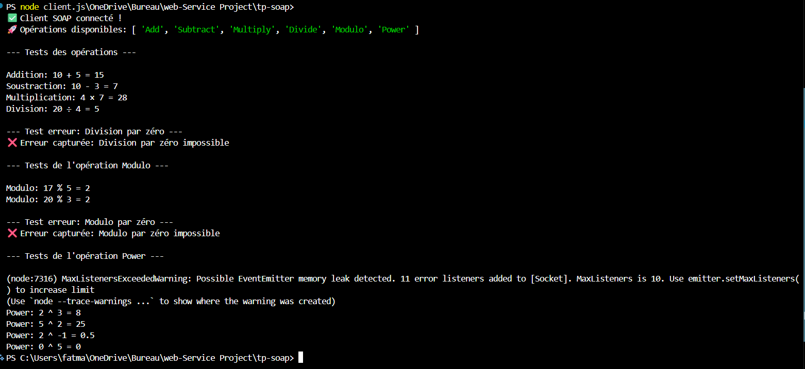
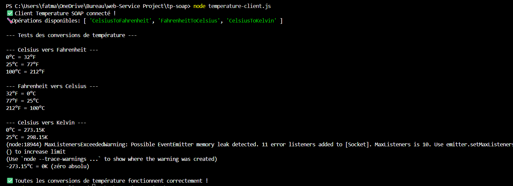
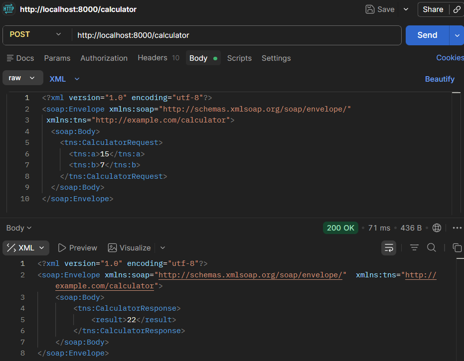

# TP-SOAP: Calculator Web Service

A SOAP web service project with two services: CalculatorService for arithmetic operations and TemperatureService for temperature conversions, built with Node.js, Express, and the SOAP library.

## Project Structure

```
tp-soap/
├── calculator.wsdl           # WSDL schema for calculator service
├── server.js                 # Calculator SOAP server
├── client.js                 # Calculator client with tests
├── temperature.wsdl          # WSDL schema for temperature service
├── temperature-server.js     # Temperature SOAP server
├── temperature-client.js     # Temperature client with tests
├── package.json              # Project dependencies and scripts
├── README.md                 # This file
└── .gitignore                # Git ignore file
```

## Services

### CalculatorService
Arithmetic operations: Add, Subtract, Multiply, Divide, Modulo, Power

### TemperatureService
Temperature conversions: Celsius ↔ Fahrenheit, Celsius → Kelvin

## Prerequisites

- Node.js (v14 or higher)
- npm

## Installation

1. Clone the repository:
```bash
git clone https://github.com/FatmaMejri1/Tp-soap.git
cd tp-soap
```

2. Install dependencies:
```bash
npm install
```

## Usage

### Start the Server
Calculator Service

#### Start the Calculator Server

```bash
npm start
```

Server runs on `http://localhost:8000`

WSDL available at: `http://localhost:8000/calculator?wsdl`

#### Test Calculator Operations

```bash
node client.js
```

### Temperature Service

#### Start the Temperature Server

```bash
npm run start:temp
```

Server runs on `http://localhost:8001`

WSDL available at: `http://localhost:8001/temperature?wsdl`

#### Test Temperature Conversions

```bash
node temperature-client.js
```
## API Operations

### Add
Adds two numbers.

**Input**: `{ a: number, b: number }`  
**Output**: `{ result: number }`

### Subtract
Subtracts the second number from the first.

**Input**: `{ a: number, b: number }`  
**Output**: `{ result: number }`

### Multiply
Multiplies two numbers.

**Input**: `{ a: number, b: number }`  
**Output**: `{ result: number }`

### Divide
Divides the first number by the second.

**Input**: `{ a: number, b: number }`  
**Output**: `{ result: number }`  
**Error**: Division by zero throws `DIVIDE_BY_ZERO` fault

### Modulo
Calculates the remainder (modulo) of the first number divided by the second.

**Input**: `{ a: number, b: number }`  
**Output**: `{ result: number }`  

### Power
Calculates the power of the first number raised to the second number (a^b).

**Input**: `{ a: number, b: number }`  
**Output**: `{ result: number }`  
**Note**: Handles negative exponents correctly using Math.pow()
**Error**: Modulo by zero throws `MODULO_BY_ZERO` fault

## Dependencies

- **express**: ^5.2.1 - Web framework
- **soap**: ^1.9.1 - SOAP library
- **body-parser**: ^2.2.2 - Middleware for parsing request bodies


## Result Screenshots


### Client Tests 


This output shows that all calculator operations are working correctly:
  
### Temperature Service
  
Client test output showing temperature conversion operations.
 
### Exemple de  Postman Test 
 
For ALL requests:

Method: POST
URL: http://localhost:8000/calculator
Headers:
Content-Type: text/xml
SOAPAction: <Add>

 

## Author

FatmaMejri1


