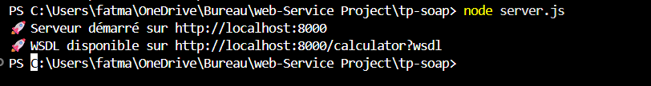

# TP-SOAP: Calculator Web Service

A SOAP web service implementation for basic arithmetic operations (Add, Subtract, Multiply, Divide, Modulo) built with Node.js, Express, and the SOAP library.

## Project Structure

```
tp-soap/
├── calculator.wsdl     # WSDL schema definition for the calculator service
├── server.js           # SOAP server implementation
├── client.js           # SOAP client with test cases
├── package.json        # Project dependencies and scripts
├── README.md           # This file
└── .gitignore          # Git ignore file
```

## Features

- **Add**: Addition of two numbers
- **Subtract**: Subtraction of two numbers
- **Multiply**: Multiplication of two numbers
- **Divide**: Division with zero-division error handling
- **Modulo**: Modulo operation (remainder) with zero-modulo error handling

## Prerequisites

- Node.js (v14 or higher)
- npm

## Installation

1. Clone the repository:
```bash
git clone https://github.com/FatmaMejri1/Tp-soap.git
cd tp-soap
```

2. Install dependencies:
```bash
npm install
```

## Usage

### Start the Server

```bash
npm start
```

The server will start on `http://localhost:8000`

WSDL is available at: `http://localhost:8000/calculator?wsdl`

### Run the Client

In a new terminal:

```bash
node client.js
```

This will test all calculator operations including error handling for division by zero.

## API Operations

### Add
Adds two numbers.

**Input**: `{ a: number, b: number }`  
**Output**: `{ result: number }`

### Subtract
Subtracts the second number from the first.

**Input**: `{ a: number, b: number }`  
**Output**: `{ result: number }`

### Multiply
Multiplies two numbers.

**Input**: `{ a: number, b: number }`  
**Output**: `{ result: number }`

### Divide
Divides the first number by the second.

**Input**: `{ a: number, b: number }`  
**Output**: `{ result: number }`  
**Error**: Division by zero throws `DIVIDE_BY_ZERO` fault

### Modulo
Calculates the remainder (modulo) of the first number divided by the second.

**Input**: `{ a: number, b: number }`  
**Output**: `{ result: number }`  
**Error**: Modulo by zero throws `MODULO_BY_ZERO` fault

## Dependencies

- **express**: ^5.2.1 - Web framework
- **soap**: ^1.9.1 - SOAP library
- **body-parser**: ^2.2.2 - Middleware for parsing request bodies

## Example

```javascript
const soap = require('soap');

async function test() {
  const client = await soap.createClientAsync('http://localhost:8000/calculator?wsdl');
  


  // Add 10 + 5
  const result = await client.AddAsync({ a: 10, b: 5 });
  console.log('Result:', result[0].result); // Output: 15
}

test();
```

## Architecture Diagram


This diagram shows the interaction between the SOAP client and server, with the WSDL schema as the contract between them.

## Screenshots

### Server Startup


The server startup screen showing the service is available on localhost:8000 with the WSDL endpoint accessible.

### Client Tests - Basic Operations


Client test output showing successful execution of Add, Subtract, Multiply, and Divide operations.

### Client Tests - Modulo Operation


Client test output showing the new Modulo operation working correctly.

### Client Tests - Error Handling


Client test output demonstrating proper error handling for division and modulo by zero.

## License

ISC

## Author

FatmaMejri1


